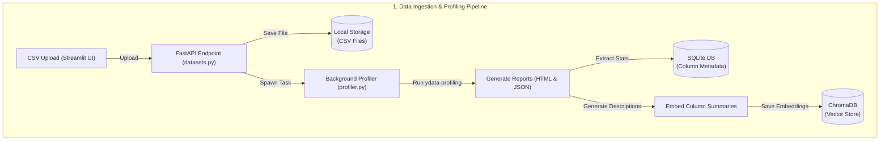
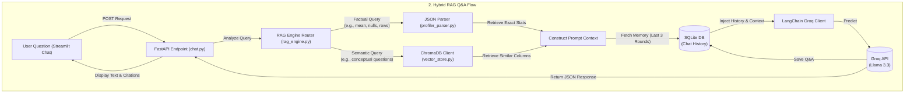

# AI-Powered NL Data Profiling Q&A Assistant

A production-grade, full-stack AI application designed to automatically profile CSV datasets, index column metadata, and provide a conversational Q&A interface using a hybrid Retrieval-Augmented Generation (RAG) architecture powered by Groq API and ChromaDB.

---

## 🛠 Technology Stack

- **Frontend**: Streamlit
- **Backend**: Python FastAPI, Uvicorn
- **Data Profiling**: `ydata-profiling` (formerly pandas-profiling), Pandas
- **Vector Database**: ChromaDB (Semantic column-schema matching)
- **Relational Database**: SQLite via SQLAlchemy (Persistent datasets, metadata, and Q&A history)
- **Orchestration**: LangChain
- **LLM**: Groq Cloud API (`llama-3.3-70b-versatile`)

---

## 🏗️ System Architecture

The application is structured as a decoupled full-stack system consisting of a Streamlit frontend client, a FastAPI backend server, local vector & relational databases, and a local LLM client:





---

## 📁 Project Structure

```text
d:/NLP/
├── app.py                      # Streamlit frontend client application
├── backend/
│   ├── api/
│   │   ├── endpoints/
│   │   │   ├── chat.py         # Chat, query, and message history routes
│   │   │   └── datasets.py     # Upload, download, profiling, and metadata routes
│   │   └── router.py           # Primary endpoint aggregator
│   ├── config.py               # Environmental configuration (Pydantic-Settings)
│   ├── logging_config.py       # Centralized system logger configs
│   ├── main.py                 # FastAPI application entrypoint and lifespan events
│   └── services/
│       ├── llm_client.py       # Groq LangChain Client wrapper
│       ├── profiler.py         # ydata-profiling analytics runner
│       ├── profiler_parser.py  # JSON statistics parser & caching loader
│       ├── rag_engine.py       # Router & LangChain Prompt template coordinator
│       └── vector_store.py     # ChromaDB collection & embedding service
├── db/
│   ├── chat_history_db.py      # Relational Q&A transaction helpers
│   ├── models.py               # SQLAlchemy schema definitions
│   └── session.py              # SQLite session provider
├── utils/
│   └── helpers.py              # Common string, file, and JSON decorators
├── requirements.txt            # System dependencies
├── .env                        # Local configurations override
└── .gitignore                  # Git ignore patterns
```

---

## 🚀 Setup & Installation

### 1. Prerequisites
- **Python 3.10+**
- **Groq API Key**: Get an API Key from the [Groq Console](https://console.groq.com/).

### 2. Installation Steps
1. Navigate to the project root directory:
   ```bash
   cd d:/NLP
   ```
2. Create and activate a python virtual environment:
   ```bash
   python -m venv venv
   # On Windows (PowerShell):
   .\venv\Scripts\Activate.ps1
   ```
3. Install all python dependencies:
   ```bash
   pip install -r requirements.txt
   ```

### 3. Environment Variables Configuration
The application automatically creates directories and handles default setups. If you need to customize settings, copy `.env.example` to `.env` or edit the existing `.env` file in the project root:
```ini
APP_ENV=development
LOG_LEVEL=INFO
DATABASE_URL=sqlite:///./data/sqlite.db
CHROMA_DB_PATH=./data/chromadb
GROQ_API_KEY=gsk_your_groq_api_key_here
GROQ_MODEL=llama-3.3-70b-versatile
UPLOAD_DIR=./data/uploads
PROFILES_DIR=./data/profiles
MAX_FILE_SIZE_MB=50
```

---

## 🏃 Running the Application

To run the complete system, you must start both the **FastAPI Backend Server** and the **Streamlit Web UI**.

### 1. Start the FastAPI Backend
Ensure your virtual environment is active and execute:
```bash
uvicorn backend.main:app --reload --host 127.0.0.1 --port 8000
```
- The backend API docs will be available at: http://127.0.0.1:8000/docs
- Relational SQLite tables are auto-created in `./data/sqlite.db` on start.

### 2. Start the Streamlit Frontend Client
Open a second terminal window, activate the virtual environment, and run:
```bash
streamlit run app.py
```
- The frontend dashboard will launch in your browser at: http://localhost:8501
