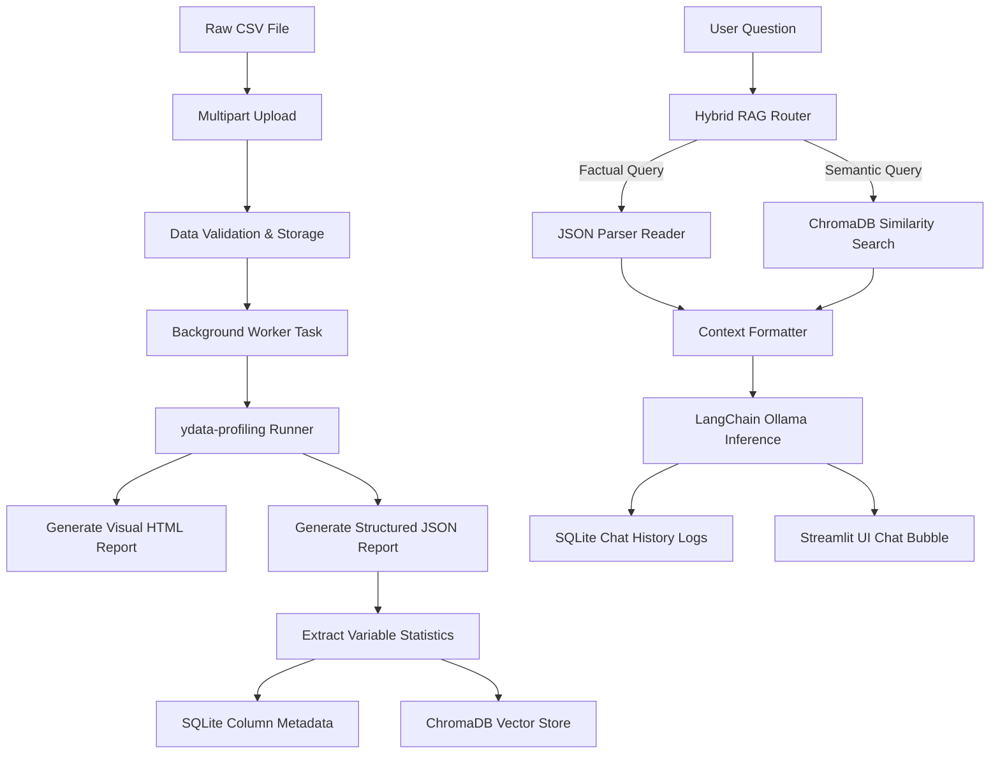

# Project Functionality & Architectural Design

This document details the functional capabilities, data flows, and internal mechanisms of the **AI-powered NL Data Profiling Q&A Assistant**.

---

## 1. Core Capabilities

The assistant integrates several modules to deliver automated data analysis and natural language question-answering:

### 📂 CSV Upload & Automated Validation
- **Action**: Users upload CSV files up to 50MB via the sidebar.
- **Validation**: Enforces `.csv` extensions and performs encoding fallbacks (`utf-8` and `latin-1` encodings) during parsing.
- **State Management**: Registers the dataset in the SQLite `datasets` table with a state of `PENDING`.

### 📊 Automated Profiling & Report Generation
- **Execution**: A background worker thread is spawned to execute the profiling pipeline.
- **Visual Report**: Runs `ydata-profiling` in `minimal=True` mode (optimized for speed) to compile a rich, interactive HTML dashboard displaying distributions, counts, variables, and correlation matrices.
- **RAG-Interoperable Report**: Saves a machine-readable JSON version of the same report for prompt injection.

### 🗄️ Relational Metadata Persistence (SQLite)
- **Extraction**: The system parses the JSON report and extracts critical statistics:
  - Row & column counts
  - Data types (Numeric, Categorical, Date, Text)
  - Missing value counts & percentages
  - Distinct count & uniqueness boolean
  - Numeric metrics: mean, minimum, and maximum boundaries
- **Storage**: Updates the `datasets` status to `PROFILED` and bulk-saves statistical characteristics into the `column_metadata` table.

### 🧠 Semantic Vector Indexing (ChromaDB)
- **Document Construction**: Creates descriptive text paragraphs summarizing the statistical characteristics of each column.
- **Embedding & Storage**: Embeds these descriptions and writes them to a dataset-specific ChromaDB vector collection.
- **Impact**: Enables semantically matching columns (e.g., matching "credentials" to a column named `SecurityKey`).

### 🔀 Hybrid RAG Engine (Routing Logic)
- **Query Router**: Assesses user questions using regex keyword triggers to determine the retrieval pathway:
  - **Factual Route (`STRUCTURED_METRICS`)**: Triggered by keywords like *mean, average, null, missing, unique, correlation, duplicates, rows, etc.* Queries exact stats from the cached JSON parser.
  - **Semantic Route (`SEMANTIC_SEARCH`)**: Triggered by conceptual or open-ended inquiries. Queries ChromaDB for the top-3 most similar column descriptions.
- **Context Construction**: Formats the retrieved facts into a clean text block for prompt injection.

### 🤖 LLM Q&A Interface with Citations
- **Prompt Guard**: Enforces strict prompt constraints instructing the LLM to only answer based on the retrieved context, returning a JSON response containing:
  - `answer`: The analytical, concise answer.
  - `citation`: The columns, table summaries, or correlation metrics referenced.
- **Memory Support**: Pulls the last 3 persistent conversation rounds (6 messages) from SQLite and feeds them into the LangChain Chat template.

### 💾 Conversational History Persistence
- **Storage**: Appends all user questions, assistant answers, and citation lists into the SQLite `chat_history` table.
- **Scoping**: Scopes chat history dynamically to the currently selected dataset.
- **Clearing**: Includes a **Clear Chat History** button to flush the database logs associated with the active dataset.

---

## 2. Step-by-Step Data Flow

### Scenario: User asks "What is the average Salary?"
1. **Chat Submission**: The user enters the query in the chat input area.
2. **Payload Dispatch**: Streamlit sends a POST request to the `/api/v1/chat/query` endpoint containing the `dataset_id`, `session_id`, and `message`.
3. **Query Routing**: The `RAGEngine` runs `determine_route("What is the average Salary?")`. The keyword `average` triggers the `STRUCTURED_METRICS` pathway.
4. **Context Retrieval**:
   - The engine checks if the column `Salary` is mentioned in the query text.
   - It fetches the dataset summary text and the specific column summary details for `Salary` from the cached JSON parser.
5. **Memory Retrieval**: Pulls the previous interactions from the database to retain conversational context.
6. **Prompt Assembly**: Merges the retrieved stats context, memory messages, and the user's question into the LangChain Chat template.
7. **LLM Inference**: The prompt is processed by the local Ollama `qwen2.5:7b` model, returning a structured JSON response.
8. **Logging & Return**: The backend logs the QA transaction in the `chat_history` table and returns the response to Streamlit, which displays the text bubble along with citation badges.

---

## 3. Caching & Performance Implementations

To run smoothly on local environments, the system implements three performance architectures:

- **JSON Parser Caching**: The `ProfilerJSONParser` class implements a class-level dictionary cache indexed by the JSON report file path. The file is only read from disk and parsed once. Subsequent queries fetch the pre-loaded dictionary instantly from memory.
- **ChromaDB Connection Caching**: The ChromaDB client is shared as a class-level singleton (`_client`), avoiding the disk locks and schema re-loading delay on every query.
- **LLM Instance Caching**: The `ChatOllama` connection object is stored as a class-level singleton (`_llm`), reusing connection pools and configurations across queries.
